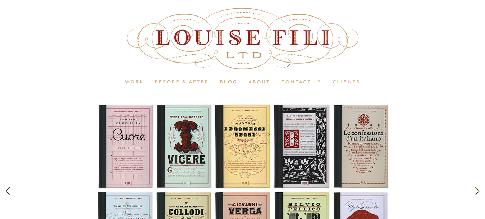
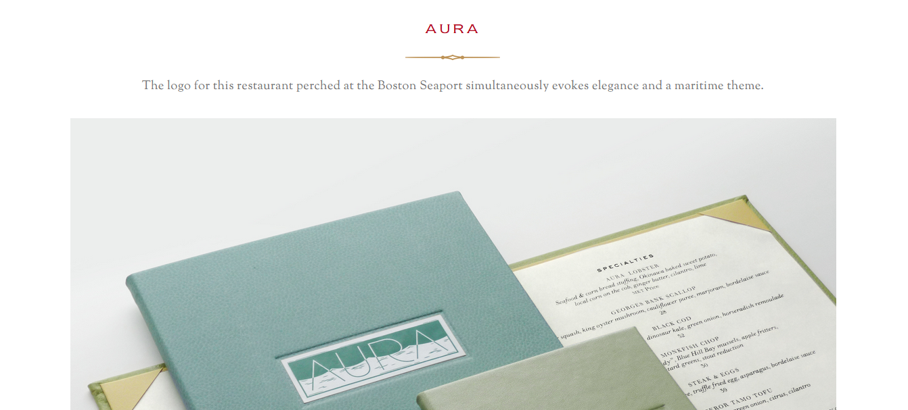
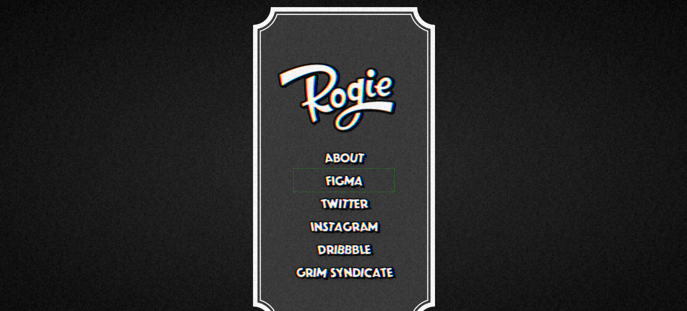
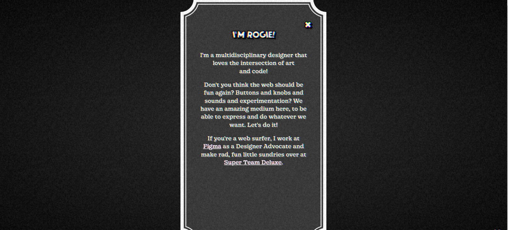
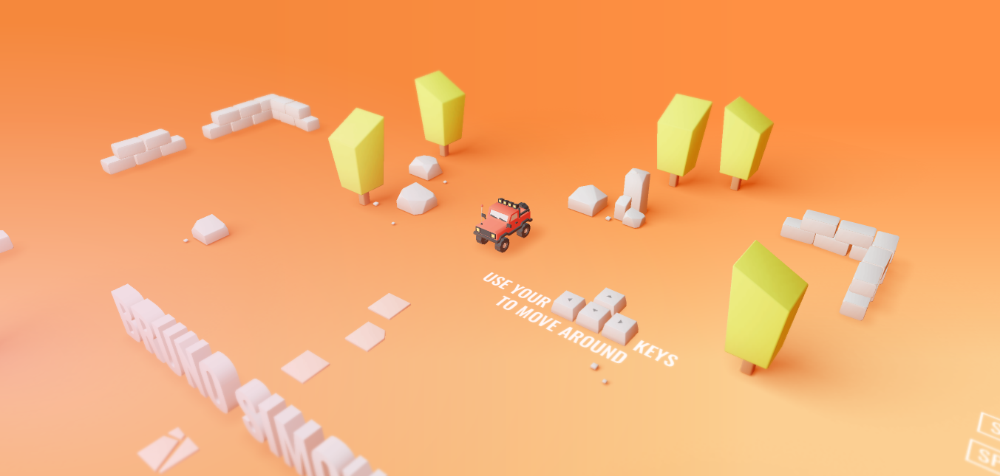

# **2024-03-28: Primer encargo**

## **Referentes**

### Portafolio de diseñadores

- **Louise Fill**: es una diseñadora gráfica estadounidense reconocida por su elegante uso de la tipografía y la calidad intemporal en su diseño.​​

[louisefili.com](https://www.louisefili.com/aura)

- **Rogie**: es conocido por su enfoque creativo y personalidad única. Destaca por marcar claramente el valor para los clientes, explicando cómo sus servicios pueden resolver problemas específicos. Además, utiliza elementos interactivos y colores brillantes para captar la atención del espectador.

[Rogie.ie](https://rog.ie/#)

- **Bruno Simon**: es un desarrollador creativo francés especializado en WebGL. Ha trabajado en muchos proyectos para clientes de renombre para crear experiencias 3D interactivas accesibles a todos desde su navegador.
  Bruno ha estado enseñando desarrollo web y WebGL en varias escuelas durante más de 7 años, convirtiéndolo en un entrenador pedagógico, teoría y práctica alterna.

[bruno-simon.com](https://bruno-simon.com/)

## Aplicacion para inspirarse

- **Behance**: es una plataforma excelente para encontrar inspiración en el diseño. Ademas es una comunidad en línea donde los diseñadores pueden mostrar sus proyectos y conectarse con otros profesionales del diseño. (Es el pinterest de diseño).

# Elemtos de HTML, CSS

### **HTML**:

**Secciones del portafolio**: Crear secciones separadas para mostrar diferentes tipos de proyectos, como diseño gráfico, diseño UX/UI, ilustraciones, etc.

**Información sobre ti**: Incluir una sección que describa quién eres, tus habilidades y tu experiencia en diseño.

**Formulario de contacto**: Agrega un formulario de contacto para que las personas puedan comunicarse fácilmente.

### **CSS**:

**Diseño y estilo**: Hcer posible la elección de colores, fuentes, diseño de botones, espaciado y otros elementos visuales para crear una apariencia que se adecue a cada persona.

**Diseño adaptable (responsive)**: Asegurarse de que la página web sea responsiva y se vea bien en todos los dispositivos y tamaños de pantalla, como computadoras, tablets y celulares.

**Animaciones y efectos**: Considera agregar animaciones y efectos visuales sutiles para mejorar la experiencia del usuario.

### **JavaScript**:

**Galería de imágenes interactiva**: Crear una galería de imágenes interactiva donde los visitantes puedan hacer clic en las imágenes para verlas en detalle o para navegar entre diferentes proyectos.

**Filtros y categorías**: Implementar filtros y categorías dinámicas para que las personas puedan explorar de manera más fácil y eficiente.
