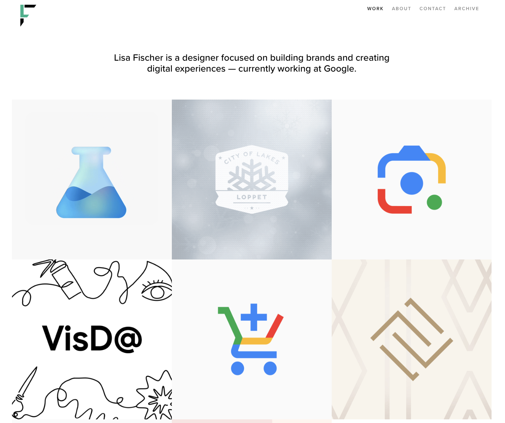
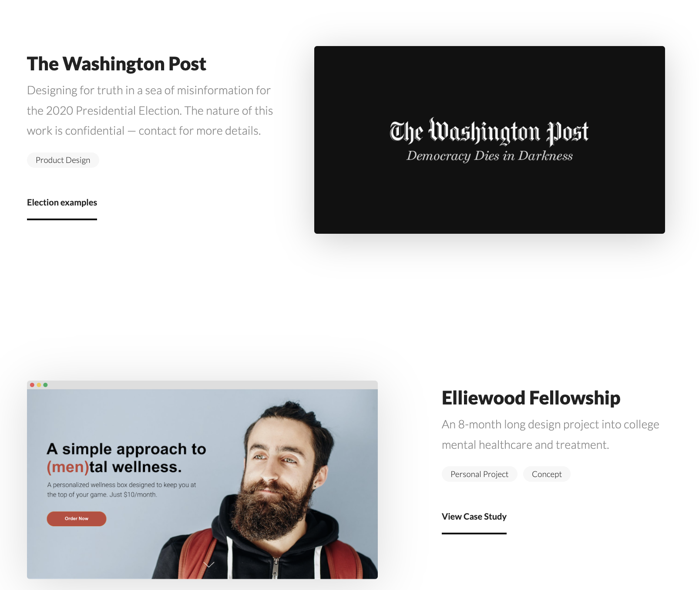
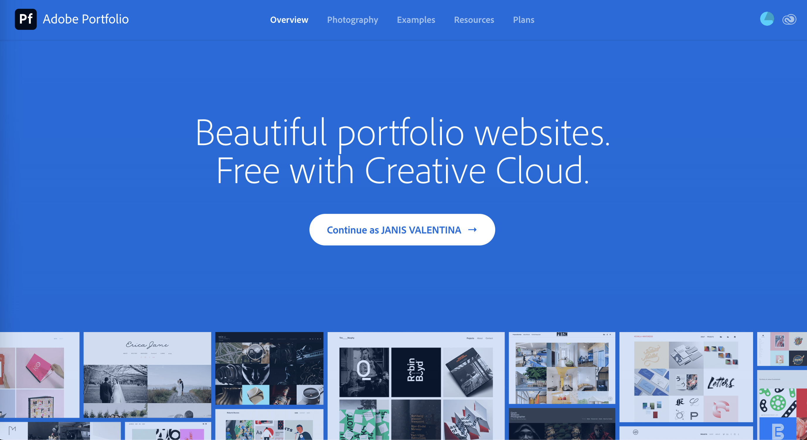
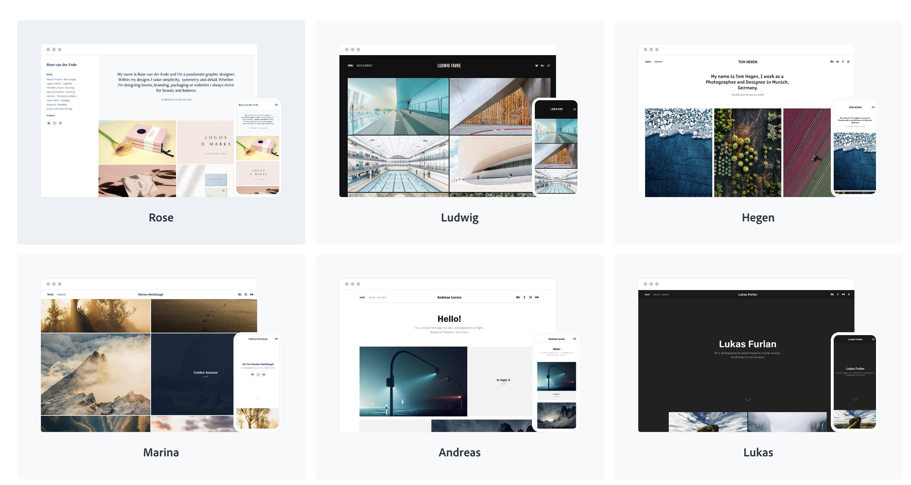

# 2024-03-28: primer encargo

## Referentes

### Portafolios de artistas y diseñadores:

- [Lisa Fischer](https://www.lisasuefischer.com/), diseñadora visual especializada en UX/UI. Su portafolio es simple y contiene elementos que pueden replicarse para la creación de plantillas.
  

 (no sé porque se ve tan pequeño)

- [Daniel Autry](https://danielautry.com/#portfolio), diseñador de productos, desarrollador e investigador de conductas (behavioral researcher). Su portafolio cuenta con tags en cada proyecto, puede ser útil al momento de filtrar información.

### Plataforma para la creación de portafolios:

- [Adobe Portfolio](https://www.portfolio.adobe.com/), plataforma de adobe gratuita para diseñar portafolios mediante plantillas. Está optimizado para crear y publicar sitios web, sin embargo esta opción es de pago. 

  
## Elementos HTML y CSS que usaremos para crear las plantillas de los portafolios:

- Uso del lenguaje markdown que facilite la lectura de los portafolios, organizando la jerarquía del texto.

- Uso de grillas simples para delimitar los espacios de los contenidos, títulos, textos e imágenes en las plantillas.

- Definir un grupo de tipografías fáciles de leer en la web.

- Portabilidad, nuestras plantillas idealmente deben visualizarse en diferentes plataformas y sistemas operativos.
