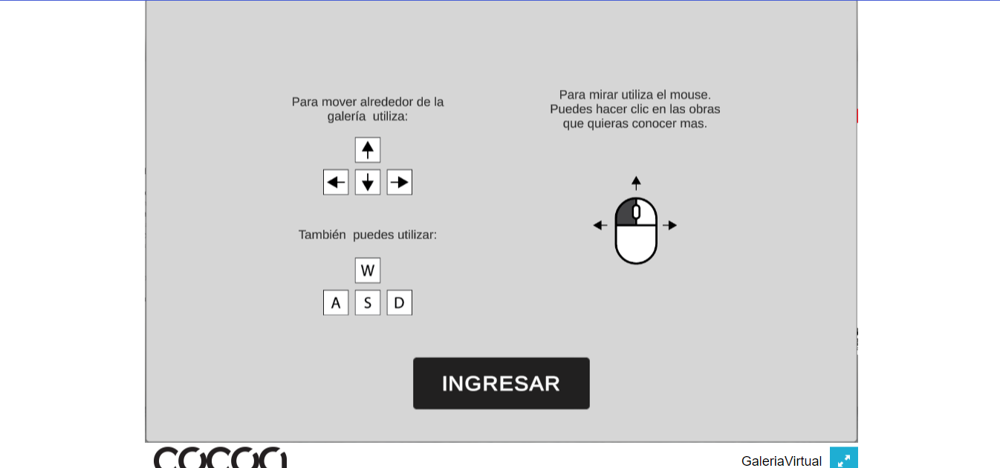
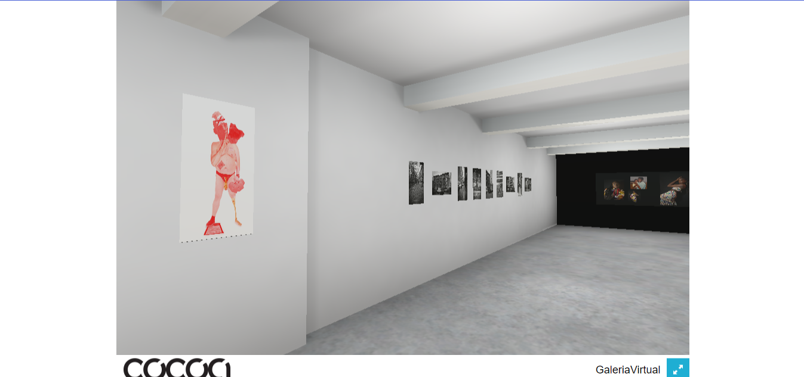
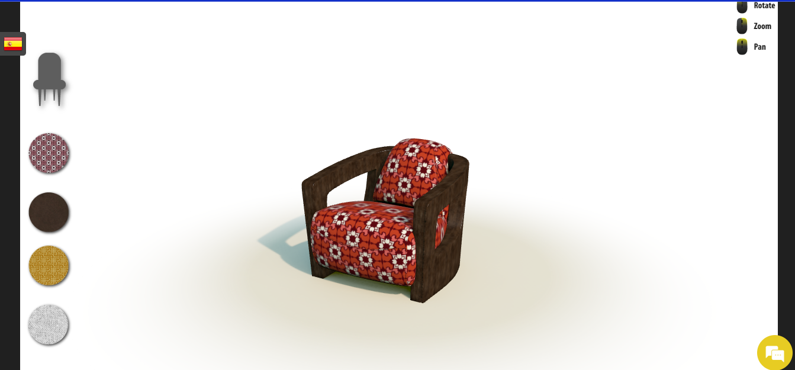
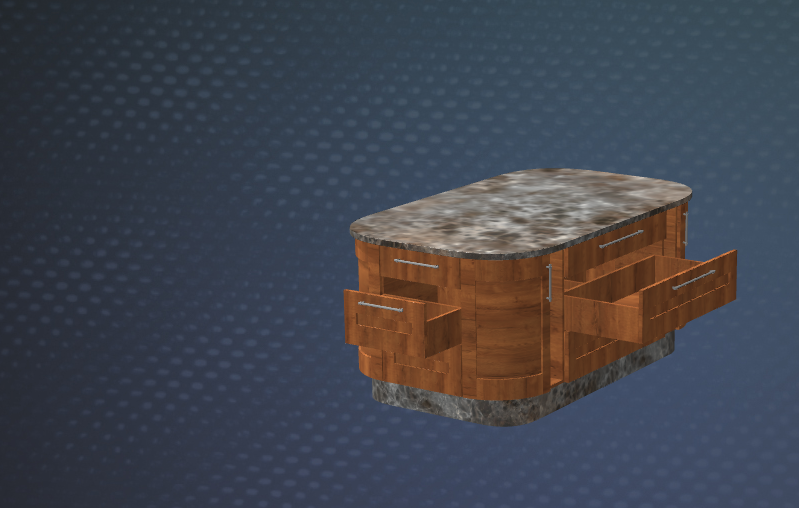
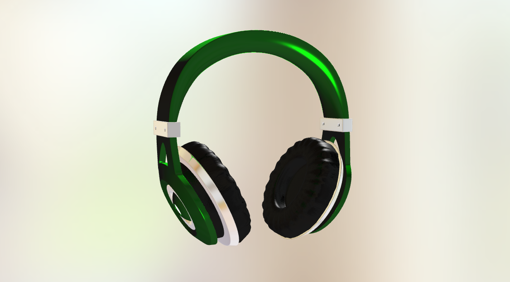
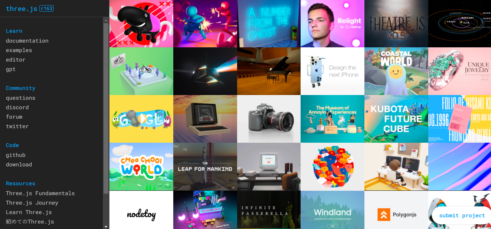
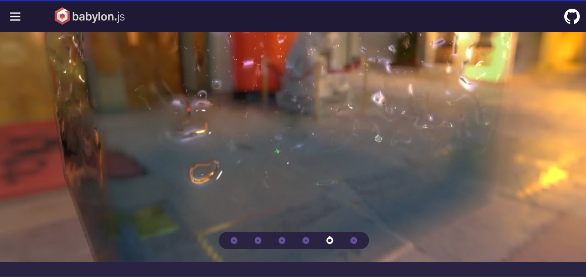
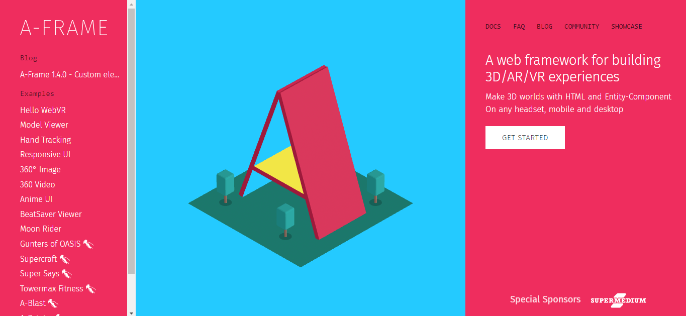

# Bitácora 2

## GALERÍAS Y EJEMPLOS DE IMPLEMENTACIÓN 3D

Esta galería al iniciar en la página contiene instrucciones claras de cómo se debe utilizar ¡ importante de agregar !

- galería de WEBGL (español) <https://qgaleria.com/galerias/virtual/>

Es una galería interactiva, de esta manera al momento de avanzar puede interactuar con las obras

- Galerías de objetos en WEBGL (español) <https://www.simlab-soft.com/SimlabArt/gallery/webgl/?locale=es>

Objetos como sillones que se pueden ver desde diferentes vistas,se le pueden cambiar los tapices. No pesa tanto, no se queda pegada la pagina y se mueve con fluidez. Gran referente de donde apoyarnos

- link al sillon (español) <https://www.simlab-soft.com/SimlabArt/gallery/webgl/chair-2/>

Objetos como muebles, en este caso la pagina si se mueve de una manera extraña, pero tiene una función extra que es que se puede abrir los cajones del mueble.

- link del mueble (español) <https://www.simlab-soft.com/SimlabArt/gallery/webgl/kitchen/>

Tambien tenemos objetos tipo audifonos, este caso cumple con las funciones basicas como girar en todos los sentidos y poder hacer zoom con el scroll, pero cuenta con otra funcion que es el cambio de color al momento del click. Esta página se queda más pegada al momento del movimiento.

- link a los audifonos (español) <https://www.simlab-soft.com/SimlabArt/gallery/webgl/headset/>

En la galería adjunta se puede llegar a hacer y subir estos tipos de modelos 3d y ellos por un periodo de prueba gratis te transforman de 3MAX a un modelo de página web como los antes mencionados

- link a la galeria ( español) <https://www.simlab-soft.com/SimlabArt/gallery/webgl/headset/>

Más pensado para las personas de Diseño gráfico y de modas he encontrado el siguiente referente en el cual también nos podríamos apoyar, siento que es una manera bastante interactiva y llamativa de exponer trabajos. Esta página SI demora en cargar pero cuando lo hace es fantástico, con el scroll del mouse se puede ir explorando los perfiles y ver de quien se quiere leer.

- link a la galeria (ingles) <https://theunknownface.com/en/stories/>

## WEBGL

“ WebGL ​ es una especificación estándar que define una API implementada en JavaScript para la renderización de gráficos en 3D dentro de cualquier navegador web. No precisa del uso de plug-ins​ adicionales en cualquier plataforma que soporte OpenGL 2.0 u OpenGL ES 2.0”

\*link a WEBGL(ingles) <https://get.webgl.org/get-a-webgl-implementation/>

WEBGL es utilizado en Three.js y tiene dos versiones, una versión 1.0 y la 2.0.
la versión 1.0 es compatible con la mayoría de los navegadores, de hecho también es compatible en móviles, la página si advierte que puede llegar a tener errores en los computadores ya que puede ser un problema de hardware, el GPU quizá no se la puede
La versión 2.0 también sigue siendo compatible casi con todos los navegadores, de hecho es compatible con los navegadores donde no lo es con la versión 1.0. También compatible con OpenGL 3.0

“OpenGL es una especificación estándar que define una API multilenguaje y multiplataforma para escribir aplicaciones que produzcan gráficos 2D y 3D.”

- Página que explica en español el funcionamiento de WEBGL y sobre como incorporar al código (español) <https://developer.mozilla.org/es/docs/Web/API/WebGL_API/Tutorial/Getting_started_with_WebGL>

- Para saber con que navegadores es compatible WEBGL (español) <https://developer.mozilla.org/es/docs/Web/API/WebGL_API>

- Fundamentos de WEBGL (portugués/ inglés) <https://webglfundamentals.org/webgl/lessons/pt-br/>

## 3ds MAX

“Autodesk 3ds Max es un programa de creación de gráficos y animación 3D desarrollado por Autodesk, en concreto la división Autodesk Media & Entertainment. Creado inicialmente por el Grupo Yost para Autodesk, salió a la venta por primera vez en 1990 para DOS.”

## RHINO Y WEBGL

La versión 5 de Rhino tiene la opción de exportar directamente a WEBGL, esto nos ayuda mucho ya que de esta manera que las personas que ya tienen sus modelos 3D no deberán hacerlos de nuevo en otra plataforma
(PROBLEMA: algunos de los modelos ya hechos desde Rhino 6 que es mas utilizados pueden no ser compatible con la versión anterior)

INFORMACIÓN INCONCLUSA, se supone que la forma de exportar se puede utilizar como “modelo directo” o “biblioteca” de manera que solo se debe aplicar al código de HTML, CSS y JS

Desde la versión de Rhino 6 no se puede traspasar de manera “directa” pero si se puede descargar de maneras en las cuales se pueden agregar a bibliotecas de WEBGL que funcionan con JS

- Las formas de exportar son OBJ, FBX O gITF

## BIBLIOTECAS DE PARA 3D

### Three.js

Una de las galerías web más importantes y que sirven de muy buena manera es Three.js, es bastante amigable, por otro lado cuenta con un apartado en la página que es para poder hacer modelos 3D o subirlos, es compatible con Rhino.

- link Three.js (ingles) <https://threejs.org/editor/>
- Cuenta con Github (ingles) <https://github.com/mrdoob/three.js/>

### Babylon.js

“Babylon.js es una biblioteca JavaScript y un motor 3D para mostrar gráficos 3D en tiempo real en un navegador web a través de HTML5. El código fuente está disponible en GitHub y se distribuye bajo la licencia Apache 2.0.”
Es código abierto y gratuito, funciona en base a nodos, es bastante poderoso y no hace que las páginas sean lentas. Compatible con Rhino

- link de Babylon.js (ingles) <https://www.babylonjs.com/>
- Cuentan con Github (ingles) <https://github.com/BabylonJS/Babylon.js>

### A-Frame

“A-Frame es un framework web de código abierto para crear experiencias de realidad virtual.​ Es mantenido por desarrolladores de Supermedium, Google y la comunidad WebVR. Es una estructura de sistema de componente de entidad para Three.js donde los desarrolladores pueden crear escenas 3D y WebVR usando HTML.”
Es de código abierto y gratuito, un poco más árido pero no difícil, se enfoca más en Realidad Virtual, pero igualmente se maneja muy bien en muestra de modelos. Compatible con Rhino

- link a A-Frame (ingles) <https://aframe.io/docs/1.5.0/introduction/>
- cuentan con Github (ingles) <https://github.com/aframevr>

