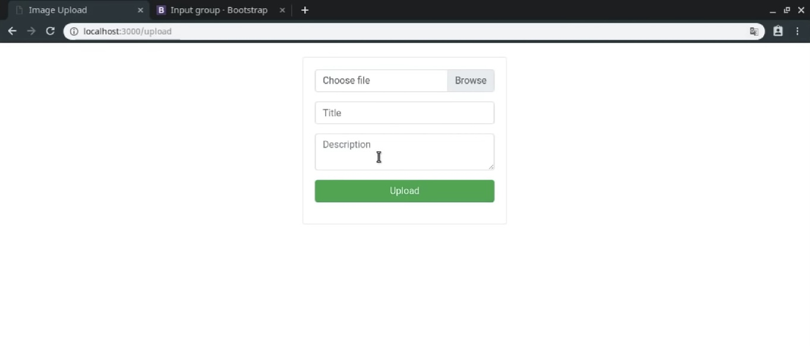
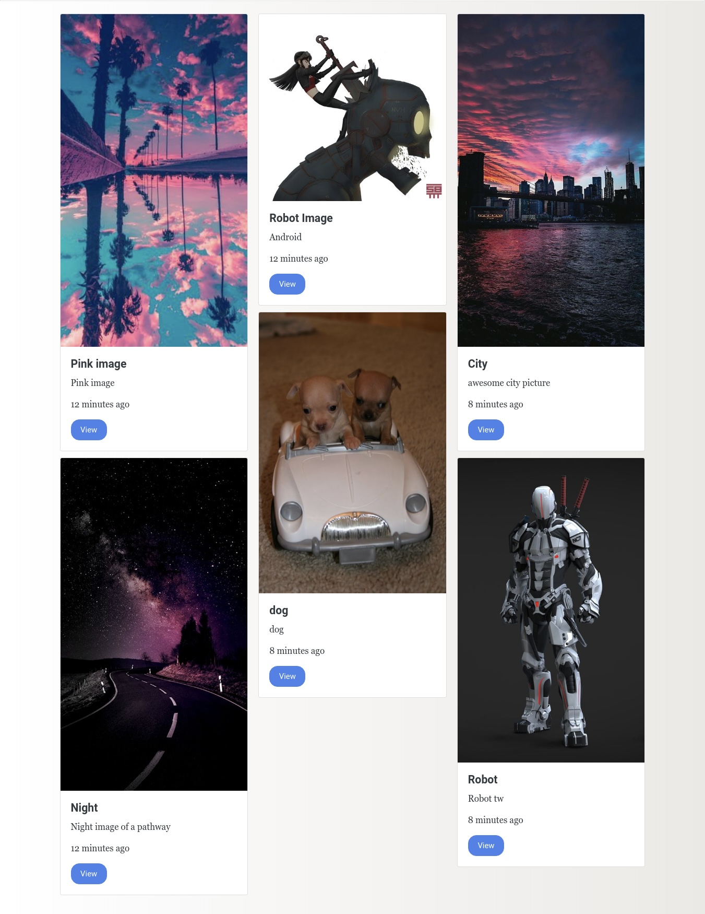

# Desarrollo galería de imágenes

## 2024-05-19: encargo 3 (avance)

### **Objetivo**

Crear un sistema de galería de imágenes utilizando herramientas de programación que permita a los usuarios cargar imágenes, visualizarlas en una interfaz amigable y eliminarlas según sea necesario.

## Desarrollo

### Investigación

- Node.js
- MongoDB

### Instalación de módulos

Primero instalé los siguientes módulos y busqué que significaba cada uno.

- **express**: es el framework backend más popular para Node.js, y es una parte extensa del ecosistema JavaScript. Está diseñado para construir aplicaciones web.
- **ejs**: Easy Java Simulators (en adelante, Ejs) es una herramienta de software diseñada para la creación de simulaciones discretas por ordenador.
- **fs-extra**: agrega métodos de sistema de archivos que no están incluidos en el fsmódulo nativo y agrega soporte de promesa a los fsmétodos.
- **Mongoose**: es una biblioteca de programación orientada a objetos - JavaScript que crea una conexión entre MongoDB y el entorno de ejecución de JavaScript Node.js Morgan ayuda en la consola lo que recibo en el servidor
- **Multer**: es un middleware de node.js para el manejo multipart/form-data, que se utiliza principalmente para cargar archivos.
  Uuid: Permite generar un id aleatorio

### Creación de archivos

- **index.js**: maneja el inicio de la aplicación, el enrutamiento y otras funciones.
- **database.js**: hacer conexión con la base de datos.

### Creación de carpetas

- Models: para guardar los modelos.
- Public: para guardar imágenes públicas.
- Routes: para definir las rutas del servidor.
- Views: para formulario en donde se subirán imágenes, imágenes listadas.

### Elaboración de rutas

Este código es un enrutador de Express para una aplicación web que permite subir imágenes, mostrarlas y eliminarlas.

```javascript
const { Router } = require('express');
const router = Router();
```

Estas líneas importan el objeto Router de Express y crean una instancia de él llamada router. El objeto Router se utiliza para definir las rutas y sus controladores en una aplicación Express.

```javascript
const Image = require('../models/image');
```

Aquí se importa el modelo Image desde el archivo image.js ubicado en el directorio models del proyecto. Este modelo está definido utilizando Mongoose para MongoDB y representa la estructura de datos de una imagen en la base de datos.

```javascript
router.get('/', (req, res) => {
  res.send('Index page');
});
```

Esta es una ruta GET para la página de carga de imágenes. Cuando un usuario accede a /upload, se renderiza la vista upload, usando un motor de plantillas EJS.

```javascript
router.post('/upload', async (req, res) => {
  const image = new Image();
  image.title = req.body.title;
  image.description = req.body.description;
  image.filename = req.file.filename;
  image.path = '/img/uploads/' + req.file.filename;
  image.originalname = req.file.originalname;
  image.mimetype = req.file.mimetype;
  image.size = req.file.size;

  await image.save();

  res.redirect('/');
});
```

Esta es una ruta POST para manejar la subida de imágenes. Cuando un formulario de carga de imágenes se envía a /upload, este controlador crea una nueva instancia de Image con los datos del formulario y la imagen subida, luego guarda la imagen en la base de datos y redirige al usuario a la página de índice.

```javascript
router.get('/image/:id', (req, res) => {
  res.send('Profile image');
});
```

Esta es una ruta GET para mostrar la página de perfil de una imagen específica. Utiliza un parámetro dinámico :id en la ruta para identificar la imagen.

```javascript
router.get('/image/:id/delete', (req, res) => {
  res.send('Image deleted');
});
```

Esta es una ruta GET para eliminar una imagen específica. Al igual que la ruta anterior, utiliza un parámetro dinámico :id para identificar la imagen que se eliminará.

```javascript
module.exports = router;
```

Finalmente, se exporta el enrutador para que pueda ser utilizado por la aplicación principal de Express.

---

### Creación del Formulario

Este código HTML permite a los usuarios cargar imágenes junto con un título y una descripción.

```html
<!DOCTYPE html>
<html lang="en">
  <head>
    <meta charset="UTF-8" />
    <meta
      name="viewport"
      content="width=device-width, initial-scale=1.0"
    />
    <title>Image Upload</title>
    <!--BOOTSTRAP 4 CDN -->
    <link
      rel="stylesheet"
      href="https://cdn.jsdelivr.net/npm/bootstrap@5.3.3/dist/css/bootstrap.min.css"
    />
  </head>
</html>
```

Estas líneas definen el comienzo del documento HTML e incluyen la declaración del tipo de documento, la configuración del idioma, y el encabezado del documento. Se establece el título de la página como "Image Upload" y se incluye el enlace a la hoja de estilos de Bootstrap 4 desde un CDN.

```html
<body>
  <div class="container p-4">
    <div class="row">
      <div class="col-md-6 offset-md-3">
        <div class="card">
          <div class="card-body">
            <form
              action="/upload"
              method="POST"
              enctype="multipart/form-data"
            ></form>
          </div>
        </div>
      </div>
    </div>
  </div>
</body>
```

Aquí comienza el cuerpo de la página. Se utiliza Bootstrap para establecer un diseño responsivo con una columna de tamaño medio centrada. Dentro de esta columna se encuentra una tarjeta (card) que contiene un formulario.

El formulario tiene un atributo action que apunta a la ruta /upload del servidor, donde se manejará la subida de la imagen. El método utilizado para enviar el formulario es POST y se especifica enctype="multipart/form-data" para permitir la carga de archivos.

```html
<div class="input-group mb-3">
  <div class="custom-file">
    <input
      type="file"
      name="image"
      class="custom-file-input"
      id="inputGroupFile02"
    />
    <label
      class="custom-file-label"
      for="inputGroupFile02"
      aria-describedby="inputGroupFileAddon02"
      >Choose file</label
    >
  </div>
</div>
```

Este es un grupo de entrada para seleccionar un archivo de imagen. Utiliza la clase custom-file de Bootstrap para estilizar el campo de entrada de archivos y el botón de selección de archivo. El campo de entrada de archivos tiene el nombre image.¨

#### Resultado formulario



---

### Almacenar en la base de datos

```javascript
const { Schema, model } = require('mongoose');
```

```javascript
const imageSchema = new Schema({
  title: { type: String },
  description: { type: String },
  filename: { type: String },
  originalname: { type: String },
  mimetype: { type: String },
  size: { type: Number },
  created_at: { type: Date, default: Date.now() },
});
```

Aquí se define un nuevo esquema llamado imageSchema utilizando la clase Schema de Mongoose. Este esquema describe la estructura de datos para un documento de imagen en la base de datos. Cada campo en el esquema corresponde a una propiedad de la imagen.

Los campos del esquema incluyen title, description, filename, originalname, mimetype, size, y created_at. Cada campo tiene un tipo de dato específico (String, Number, Date) que indica el tipo de valor que puede contener.

created_at utiliza Date.now() como valor predeterminado, lo que significa que si no se proporciona un valor para este campo al crear un nuevo documento de imagen, se establecerá automáticamente en la fecha y hora actuales.

```javascript
module.exports = model('image', imageSchema);
```

Finalmente, se exporta el modelo de imagen utilizando la función model() de Mongoose. El primer argumento 'image' es el nombre del modelo y el segundo argumento imageSchema es el esquema que se utilizará para este modelo. Esto permite que otros archivos de la aplicación importen y utilicen este modelo para interactuar con los documentos de imagen en la base de datos MongoDB.

---

### Pendientes

- Por ahora he desarrollado esto hasta acá, tuve problemas al iniciar Mongodb y no alcancé a solucionarlo (estoy en eso).
- Como proyección ya al subir las imágenes, incorporar el diseño de la interfaz ( Masonry layout )

Referente

